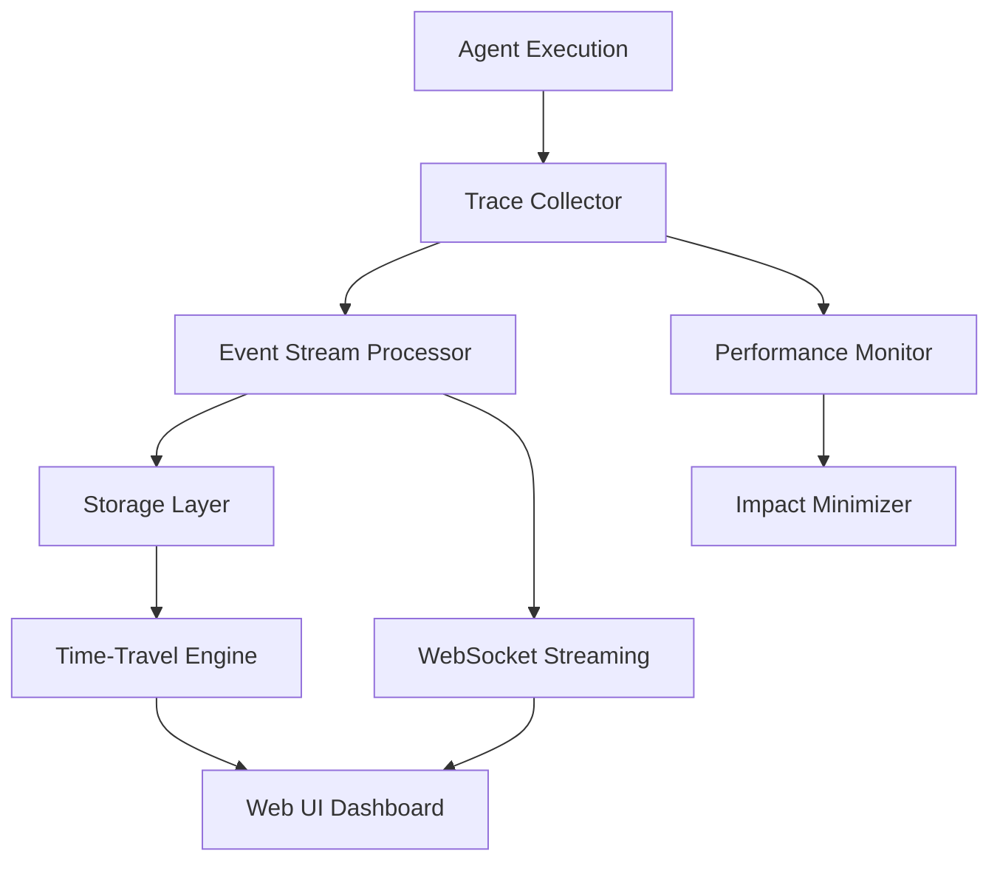

# Claude-Flow Tracing and Visualization System
## LangGraph Studio-Level Implementation Guide

### Executive Summary

This document provides a comprehensive implementation guide for building a real-time tracing and visualization system for Claude-Flow that matches the capabilities of LangGraph Studio. The system will provide live agent communication tracing, time-travel debugging, and interactive graph visualization with minimal performance impact.

**Estimated Implementation:** 6-8 weeks (3 phases)
**Performance Impact:** <5% overhead
**Real-time Latency:** <100ms

---

## 1. System Architecture Overview

### 1.1 High-Level Components



### 1.2 Integration Points

The system leverages existing Claude-Flow infrastructure:

- **EventBus**: Enhanced for trace event streaming
- **WebSocket Server**: Extended for real-time data delivery
- **Web UI**: New tracing views with React/D3.js
- **Memory Manager**: Trace storage and indexing
- **Agent Coordinator**: Instrumentation hooks

---

## 2. Data Collection Strategy

### 2.1 Trace Event Schema

```typescript
interface TraceEvent {
  id: string;
  timestamp: number;
  sessionId: string;
  agentId: string;
  type: TraceEventType;
  phase: 'start' | 'progress' | 'complete' | 'error';
  data: TraceEventData;
  metadata: TraceMetadata;
  performance: PerformanceMetrics;
}

interface TraceEventData {
  // Input/Output traces
  prompt?: string;
  response?: string;
  tools?: ToolCall[];
  
  // Communication traces
  message?: AgentMessage;
  coordination?: CoordinationEvent;
  
  // Execution traces
  task?: TaskExecution;
  decision?: DecisionPoint;
  
  // Memory traces
  memoryAccess?: MemoryOperation;
  context?: ContextUpdate;
}

interface TraceMetadata {
  parentId?: string;
  causationId?: string;
  correlationId: string;
  tags: string[];
  priority: 'low' | 'normal' | 'high' | 'critical';
  retention: number; // hours
}

interface PerformanceMetrics {
  duration: number;
  memoryUsage: number;
  tokenCount?: number;
  cpuTime: number;
}
```

### 2.2 Collection Points

#### Agent Instrumentation
```typescript
// src/tracing/agent-instrumentation.ts
export class AgentInstrumentation {
  private collector: TraceCollector;
  
  instrumentAgent(agent: SwarmAgent): SwarmAgent {
    return new Proxy(agent, {
      get(target, prop) {
        if (typeof target[prop] === 'function') {
          return this.instrumentMethod(target, prop);
        }
        return target[prop];
      }
    });
  }
  
  private instrumentMethod(target: any, methodName: string) {
    const original = target[methodName];
    return async (...args: any[]) => {
      const traceId = generateTraceId();
      const startTime = performance.now();
      
      // Start trace
      this.collector.startTrace({
        id: traceId,
        agentId: target.id,
        type: 'agent_method',
        method: methodName,
        args: this.sanitizeArgs(args),
        timestamp: Date.now()
      });
      
      try {
        const result = await original.apply(target, args);
        
        // Complete trace
        this.collector.completeTrace(traceId, {
          result: this.sanitizeResult(result),
          duration: performance.now() - startTime
        });
        
        return result;
      } catch (error) {
        // Error trace
        this.collector.errorTrace(traceId, error);
        throw error;
      }
    };
  }
}
```

#### Communication Tracing
```typescript
// Enhanced EventBus with tracing
export class TracingEventBus extends EventBus {
  private traceCollector: TraceCollector;
  
  emit(event: string, data?: unknown): void {
    // Capture communication trace
    this.traceCollector.captureEvent({
      type: 'communication',
      event,
      data: this.sanitizeData(data),
      timestamp: Date.now(),
      source: this.getCurrentContext()
    });
    
    super.emit(event, data);
  }
}
```

---

## 3. Storage Schema for Traces

### 3.1 SQLite Schema Design

```sql
-- src/tracing/schema.sql
CREATE TABLE traces (
  id TEXT PRIMARY KEY,
  session_id TEXT NOT NULL,
  agent_id TEXT,
  type TEXT NOT NULL,
  phase TEXT NOT NULL,
  timestamp INTEGER NOT NULL,
  parent_id TEXT,
  correlation_id TEXT NOT NULL,
  data JSON,
  metadata JSON,
  performance JSON,
  created_at INTEGER DEFAULT (unixepoch()),
  INDEX idx_session_timestamp (session_id, timestamp),
  INDEX idx_agent_timestamp (agent_id, timestamp),
  INDEX idx_correlation (correlation_id),
  INDEX idx_parent_child (parent_id, id)
);

CREATE TABLE trace_relationships (
  id INTEGER PRIMARY KEY,
  parent_id TEXT NOT NULL,
  child_id TEXT NOT NULL,
  relationship_type TEXT NOT NULL, -- 'sequence', 'parallel', 'spawn', 'callback'
  created_at INTEGER DEFAULT (unixepoch()),
  UNIQUE(parent_id, child_id)
);

CREATE TABLE sessions (
  id TEXT PRIMARY KEY,
  name TEXT,
  start_time INTEGER NOT NULL,
  end_time INTEGER,
  status TEXT NOT NULL DEFAULT 'active',
  metadata JSON,
  created_at INTEGER DEFAULT (unixepoch())
);

CREATE TABLE performance_snapshots (
  id INTEGER PRIMARY KEY,
  session_id TEXT NOT NULL,
  timestamp INTEGER NOT NULL,
  metrics JSON NOT NULL,
  created_at INTEGER DEFAULT (unixepoch()),
  INDEX idx_session_time (session_id, timestamp)
);
```

### 3.2 Storage Implementation

```typescript
// src/tracing/storage/trace-storage.ts
export class TraceStorage {
  constructor(private db: Database, private config: StorageConfig) {}
  
  async storeTrace(trace: TraceEvent): Promise<void> {
    const stmt = this.db.prepare(`
      INSERT INTO traces (
        id, session_id, agent_id, type, phase, timestamp,
        parent_id, correlation_id, data, metadata, performance
      ) VALUES (?, ?, ?, ?, ?, ?, ?, ?, ?, ?, ?)
    `);
    
    await stmt.run(
      trace.id,
      trace.sessionId,
      trace.agentId,
      trace.type,
      trace.phase,
      trace.timestamp,
      trace.metadata.parentId,
      trace.metadata.correlationId,
      JSON.stringify(trace.data),
      JSON.stringify(trace.metadata),
      JSON.stringify(trace.performance)
    );
    
    // Update relationships
    if (trace.metadata.parentId) {
      await this.addRelationship(trace.metadata.parentId, trace.id, 'sequence');
    }
  }
  
  async getTracesBySession(sessionId: string, timeRange?: TimeRange): Promise<TraceEvent[]> {
    let query = 'SELECT * FROM traces WHERE session_id = ?';
    const params = [sessionId];
    
    if (timeRange) {
      query += ' AND timestamp BETWEEN ? AND ?';
      params.push(timeRange.start, timeRange.end);
    }
    
    query += ' ORDER BY timestamp ASC';
    
    const rows = this.db.prepare(query).all(...params);
    return rows.map(this.deserializeTrace);
  }
  
  async getTraceGraph(sessionId: string): Promise<TraceGraph> {
    const traces = await this.getTracesBySession(sessionId);
    const relationships = await this.getRelationships(sessionId);
    
    return new TraceGraphBuilder()
      .withTraces(traces)
      .withRelationships(relationships)
      .build();
  }
}
```

---

## 4. WebSocket-Based Live Streaming

### 4.1 Real-Time Event Streaming

```typescript
// src/tracing/streaming/trace-streamer.ts
export class TraceStreamer {
  private wss: WebSocketServer;
  private clients = new Map<string, TraceClient>();
  
  constructor(private eventBus: EventBus, private storage: TraceStorage) {
    this.setupWebSocketServer();
    this.setupEventListeners();
  }
  
  private setupWebSocketServer(): void {
    this.wss = new WebSocketServer({ port: 8080 });
    
    this.wss.on('connection', (ws, req) => {
      const clientId = generateClientId();
      const client = new TraceClient(clientId, ws);
      
      this.clients.set(clientId, client);
      
      ws.on('message', (data) => {
        this.handleClientMessage(client, JSON.parse(data.toString()));
      });
      
      ws.on('close', () => {
        this.clients.delete(clientId);
      });
      
      // Send initial state
      this.sendInitialState(client);
    });
  }
  
  private setupEventListeners(): void {
    this.eventBus.on('trace:*', (event, data) => {
      this.broadcastTraceEvent({
        type: 'trace_event',
        event,
        data,
        timestamp: Date.now()
      });
    });
    
    this.eventBus.on('agent:*', (event, data) => {
      this.broadcastAgentEvent({
        type: 'agent_event',
        event,
        data,
        timestamp: Date.now()
      });
    });
  }
  
  private broadcastTraceEvent(event: StreamEvent): void {
    const message = JSON.stringify(event);
    
    this.clients.forEach((client) => {
      if (client.isSubscribedTo(event)) {
        client.send(message);
      }
    });
  }
  
  async handleClientMessage(client: TraceClient, message: ClientMessage): Promise<void> {
    switch (message.type) {
      case 'subscribe_session':
        await this.subscribeToSession(client, message.sessionId);
        break;
        
      case 'request_history':
        await this.sendHistoricalData(client, message.timeRange);
        break;
        
      case 'time_travel':
        await this.handleTimeTravel(client, message.timestamp);
        break;
        
      case 'filter_agents':
        client.setAgentFilter(message.agentIds);
        break;
    }
  }
}

class TraceClient {
  private subscriptions = new Set<string>();
  private agentFilter?: string[];
  
  constructor(
    public id: string,
    private ws: WebSocket
  ) {}
  
  send(message: string): void {
    if (this.ws.readyState === WebSocket.OPEN) {
      this.ws.send(message);
    }
  }
  
  isSubscribedTo(event: StreamEvent): boolean {
    if (this.agentFilter && event.data.agentId) {
      return this.agentFilter.includes(event.data.agentId);
    }
    return this.subscriptions.has(event.data.sessionId);
  }
}
```

### 4.2 Event Compression and Batching

```typescript
// src/tracing/streaming/event-compressor.ts
export class EventCompressor {
  private batchSize = 50;
  private batchTimeout = 100; // ms
  private pendingBatches = new Map<string, TraceEvent[]>();
  private timers = new Map<string, NodeJS.Timeout>();
  
  compress(events: TraceEvent[]): CompressedBatch {
    return {
      events: events.map(this.compressEvent),
      compression: 'delta',
      timestamp: Date.now()
    };
  }
  
  private compressEvent(event: TraceEvent): CompressedEvent {
    // Remove redundant data, compress JSON
    return {
      id: event.id,
      t: event.timestamp,
      a: event.agentId,
      type: event.type,
      data: this.compressData(event.data)
    };
  }
  
  batchEvents(sessionId: string, event: TraceEvent): void {
    if (!this.pendingBatches.has(sessionId)) {
      this.pendingBatches.set(sessionId, []);
    }
    
    const batch = this.pendingBatches.get(sessionId)!;
    batch.push(event);
    
    if (batch.length >= this.batchSize) {
      this.flushBatch(sessionId);
    } else if (!this.timers.has(sessionId)) {
      const timer = setTimeout(() => {
        this.flushBatch(sessionId);
      }, this.batchTimeout);
      this.timers.set(sessionId, timer);
    }
  }
  
  private flushBatch(sessionId: string): void {
    const batch = this.pendingBatches.get(sessionId);
    if (!batch || batch.length === 0) return;
    
    const compressed = this.compress(batch);
    this.eventBus.emit('compressed_batch', { sessionId, batch: compressed });
    
    this.pendingBatches.delete(sessionId);
    const timer = this.timers.get(sessionId);
    if (timer) {
      clearTimeout(timer);
      this.timers.delete(sessionId);
    }
  }
}
```

---

## 5. Web UI Architecture

### 5.1 React Component Structure

```typescript
// src/ui/tracing/components/TracingDashboard.tsx
import React, { useState, useEffect } from 'react';
import { TraceGraph } from './TraceGraph';
import { TimelineView } from './TimelineView';
import { AgentPanel } from './AgentPanel';
import { DebugPanel } from './DebugPanel';

export const TracingDashboard: React.FC = () => {
  const [session, setSession] = useState<TraceSession | null>(null);
  const [traces, setTraces] = useState<TraceEvent[]>([]);
  const [currentTime, setCurrentTime] = useState<number>(Date.now());
  const [isLive, setIsLive] = useState(true);
  
  const traceSocket = useTraceWebSocket();
  
  useEffect(() => {
    traceSocket.on('trace_event', (event) => {
      if (isLive) {
        setTraces(prev => [...prev, event].slice(-1000)); // Keep last 1000
      }
    });
    
    traceSocket.on('batch_events', (batch) => {
      if (isLive) {
        setTraces(prev => [...prev, ...batch.events].slice(-1000));
      }
    });
  }, [traceSocket, isLive]);
  
  const handleTimeTravel = (timestamp: number) => {
    setIsLive(false);
    setCurrentTime(timestamp);
    traceSocket.emit('time_travel', { timestamp });
  };
  
  const filteredTraces = useMemo(() => {
    return traces.filter(trace => trace.timestamp <= currentTime);
  }, [traces, currentTime]);
  
  return (
    <div className="tracing-dashboard">
      <div className="dashboard-header">
        <SessionSelector onSessionChange={setSession} />
        <LiveToggle isLive={isLive} onToggle={setIsLive} />
        <TimeControls 
          currentTime={currentTime}
          onTimeChange={handleTimeTravel}
          isLive={isLive}
        />
      </div>
      
      <div className="dashboard-content">
        <div className="left-panel">
          <AgentPanel traces={filteredTraces} />
        </div>
        
        <div className="main-content">
          <TraceGraph 
            traces={filteredTraces}
            onNodeClick={handleNodeClick}
            layout="hierarchical"
          />
          <TimelineView 
            traces={filteredTraces}
            currentTime={currentTime}
            onTimeSelect={handleTimeTravel}
          />
        </div>
        
        <div className="right-panel">
          <DebugPanel 
            selectedTrace={selectedTrace}
            onStepInto={handleStepInto}
            onStepOver={handleStepOver}
          />
        </div>
      </div>
    </div>
  );
};
```

### 5.2 Graph Visualization with D3.js

```typescript
// src/ui/tracing/components/TraceGraph.tsx
import React, { useRef, useEffect } from 'react';
import * as d3 from 'd3';

interface TraceGraphProps {
  traces: TraceEvent[];
  onNodeClick: (trace: TraceEvent) => void;
  layout: 'hierarchical' | 'force' | 'timeline';
}

export const TraceGraph: React.FC<TraceGraphProps> = ({ 
  traces, 
  onNodeClick, 
  layout 
}) => {
  const svgRef = useRef<SVGSVGElement>(null);
  const [dimensions, setDimensions] = useState({ width: 800, height: 600 });
  
  useEffect(() => {
    if (!svgRef.current || traces.length === 0) return;
    
    const svg = d3.select(svgRef.current);
    svg.selectAll("*").remove(); // Clear previous render
    
    const graphData = buildGraphData(traces);
    
    switch (layout) {
      case 'hierarchical':
        renderHierarchicalLayout(svg, graphData, dimensions);
        break;
      case 'force':
        renderForceLayout(svg, graphData, dimensions);
        break;
      case 'timeline':
        renderTimelineLayout(svg, graphData, dimensions);
        break;
    }
  }, [traces, layout, dimensions]);
  
  return (
    <div className="trace-graph">
      <div className="graph-controls">
        <LayoutSelector currentLayout={layout} onLayoutChange={setLayout} />
        <ZoomControls svgRef={svgRef} />
        <FilterControls />
      </div>
      
      <svg 
        ref={svgRef}
        width={dimensions.width}
        height={dimensions.height}
        className="graph-svg"
      />
    </div>
  );
};

function renderHierarchicalLayout(
  svg: d3.Selection<SVGSVGElement, unknown, null, undefined>,
  data: GraphData,
  dimensions: { width: number; height: number }
) {
  const hierarchy = d3.hierarchy(data.root);
  const treeLayout = d3.tree<TraceNode>()
    .size([dimensions.width - 100, dimensions.height - 100]);
  
  const root = treeLayout(hierarchy);
  
  // Draw links
  const links = svg.selectAll('.link')
    .data(root.links())
    .enter()
    .append('path')
    .attr('class', 'link')
    .attr('d', d3.linkHorizontal()
      .x(d => d.y + 50)
      .y(d => d.x + 50)
    )
    .style('fill', 'none')
    .style('stroke', '#999')
    .style('stroke-width', 2);
  
  // Draw nodes
  const nodes = svg.selectAll('.node')
    .data(root.descendants())
    .enter()
    .append('g')
    .attr('class', 'node')
    .attr('transform', d => `translate(${d.y + 50}, ${d.x + 50})`)
    .on('click', (event, d) => onNodeClick(d.data.trace));
  
  nodes.append('circle')
    .attr('r', 8)
    .style('fill', d => getNodeColor(d.data))
    .style('stroke', '#333')
    .style('stroke-width', 2);
  
  nodes.append('text')
    .attr('dx', 12)
    .attr('dy', 4)
    .text(d => d.data.label)
    .style('font-size', '12px')
    .style('fill', '#333');
}

function getNodeColor(node: TraceNode): string {
  const colorMap = {
    'agent_method': '#4CAF50',
    'communication': '#2196F3',
    'task_execution': '#FF9800',
    'memory_access': '#9C27B0',
    'error': '#F44336'
  };
  
  return colorMap[node.trace.type] || '#757575';
}
```

### 5.3 Timeline Visualization

```typescript
// src/ui/tracing/components/TimelineView.tsx
export const TimelineView: React.FC<TimelineProps> = ({
  traces,
  currentTime,
  onTimeSelect
}) => {
  const containerRef = useRef<HTMLDivElement>(null);
  
  useEffect(() => {
    if (!containerRef.current) return;
    
    const svg = d3.select(containerRef.current)
      .select('svg')
      .attr('width', '100%')
      .attr('height', 200);
    
    const timeScale = d3.scaleTime()
      .domain(d3.extent(traces, d => d.timestamp))
      .range([50, width - 50]);
    
    const agentScale = d3.scaleBand()
      .domain(Array.from(new Set(traces.map(t => t.agentId))))
      .range([20, 180])
      .padding(0.1);
    
    // Draw agent lanes
    svg.selectAll('.agent-lane')
      .data(agentScale.domain())
      .enter()
      .append('rect')
      .attr('class', 'agent-lane')
      .attr('x', 0)
      .attr('y', d => agentScale(d))
      .attr('width', '100%')
      .attr('height', agentScale.bandwidth())
      .style('fill', (d, i) => d3.schemeCategory10[i % 10])
      .style('opacity', 0.1);
    
    // Draw trace events
    svg.selectAll('.trace-event')
      .data(traces)
      .enter()
      .append('circle')
      .attr('class', 'trace-event')
      .attr('cx', d => timeScale(d.timestamp))
      .attr('cy', d => agentScale(d.agentId) + agentScale.bandwidth() / 2)
      .attr('r', 4)
      .style('fill', d => getEventColor(d))
      .on('click', (event, d) => onTimeSelect(d.timestamp));
    
    // Draw current time indicator
    const currentTimeX = timeScale(currentTime);
    svg.select('.current-time-line').remove();
    svg.append('line')
      .attr('class', 'current-time-line')
      .attr('x1', currentTimeX)
      .attr('x2', currentTimeX)
      .attr('y1', 0)
      .attr('y2', 200)
      .style('stroke', '#FF5722')
      .style('stroke-width', 2);
      
  }, [traces, currentTime]);
  
  return (
    <div ref={containerRef} className="timeline-view">
      <svg></svg>
    </div>
  );
};
```

---

## 6. Time-Travel Debugging

### 6.1 State Reconstruction Engine

```typescript
// src/tracing/time-travel/state-reconstructor.ts
export class StateReconstructor {
  constructor(
    private storage: TraceStorage,
    private snapshotManager: SnapshotManager
  ) {}
  
  async reconstructState(sessionId: string, timestamp: number): Promise<SystemState> {
    // Find nearest snapshot before timestamp
    const snapshot = await this.snapshotManager.findNearestSnapshot(sessionId, timestamp);
    
    let baseState: SystemState;
    let fromTime: number;
    
    if (snapshot) {
      baseState = snapshot.state;
      fromTime = snapshot.timestamp;
    } else {
      baseState = this.createEmptyState();
      fromTime = 0;
    }
    
    // Get all events between snapshot and target time
    const events = await this.storage.getTracesBySession(sessionId, {
      start: fromTime,
      end: timestamp
    });
    
    // Apply events to reconstruct state
    return this.applyEvents(baseState, events);
  }
  
  private applyEvents(state: SystemState, events: TraceEvent[]): SystemState {
    const reconstructedState = { ...state };
    
    for (const event of events) {
      this.applyEvent(reconstructedState, event);
    }
    
    return reconstructedState;
  }
  
  private applyEvent(state: SystemState, event: TraceEvent): void {
    switch (event.type) {
      case 'agent_spawn':
        state.agents[event.agentId] = {
          id: event.agentId,
          status: 'active',
          createdAt: event.timestamp
        };
        break;
        
      case 'task_start':
        state.tasks[event.data.taskId] = {
          id: event.data.taskId,
          agentId: event.agentId,
          status: 'running',
          startedAt: event.timestamp
        };
        break;
        
      case 'memory_write':
        state.memory[event.data.key] = {
          value: event.data.value,
          timestamp: event.timestamp,
          agentId: event.agentId
        };
        break;
        
      case 'communication':
        if (!state.communications[event.agentId]) {
          state.communications[event.agentId] = [];
        }
        state.communications[event.agentId].push({
          message: event.data.message,
          timestamp: event.timestamp,
          direction: event.data.direction
        });
        break;
    }
  }
}
```

### 6.2 Interactive Debugging Interface

```typescript
// src/ui/tracing/components/DebugPanel.tsx
export const DebugPanel: React.FC<DebugPanelProps> = ({
  selectedTrace,
  sessionId,
  currentTime
}) => {
  const [debugState, setDebugState] = useState<DebugState>('paused');
  const [breakpoints, setBreakpoints] = useState<Set<string>>(new Set());
  const [watchList, setWatchList] = useState<WatchExpression[]>([]);
  
  const timeTravel = useTimeTravel(sessionId);
  
  const handleStepInto = async () => {
    if (!selectedTrace) return;
    
    const childTraces = await getChildTraces(selectedTrace.id);
    if (childTraces.length > 0) {
      timeTravel.goToTrace(childTraces[0]);
    }
  };
  
  const handleStepOver = async () => {
    if (!selectedTrace) return;
    
    const nextSiblingTrace = await getNextSiblingTrace(selectedTrace.id);
    if (nextSiblingTrace) {
      timeTravel.goToTrace(nextSiblingTrace);
    }
  };
  
  const handleStepOut = async () => {
    if (!selectedTrace?.metadata.parentId) return;
    
    const parentTrace = await getTrace(selectedTrace.metadata.parentId);
    if (parentTrace) {
      timeTravel.goToTrace(parentTrace);
    }
  };
  
  return (
    <div className="debug-panel">
      <div className="debug-controls">
        <button 
          onClick={handleStepInto}
          disabled={debugState !== 'paused'}
          className="debug-btn step-into"
        >
          Step Into
        </button>
        
        <button 
          onClick={handleStepOver}
          disabled={debugState !== 'paused'}
          className="debug-btn step-over"
        >
          Step Over
        </button>
        
        <button 
          onClick={handleStepOut}
          disabled={debugState !== 'paused'}
          className="debug-btn step-out"
        >
          Step Out
        </button>
        
        <button 
          onClick={() => timeTravel.resume()}
          disabled={debugState === 'running'}
          className="debug-btn resume"
        >
          Resume
        </button>
      </div>
      
      <div className="debug-info">
        <TraceDetails trace={selectedTrace} />
        <VariableInspector 
          trace={selectedTrace}
          watchList={watchList}
          onAddWatch={addWatchExpression}
        />
        <CallStack sessionId={sessionId} currentTrace={selectedTrace} />
      </div>
      
      <div className="breakpoints">
        <BreakpointManager
          breakpoints={breakpoints}
          onToggleBreakpoint={toggleBreakpoint}
          sessionId={sessionId}
        />
      </div>
    </div>
  );
};
```

---

## 7. Performance Impact Minimization

### 7.1 Selective Instrumentation

```typescript
// src/tracing/performance/selective-tracer.ts
export class SelectiveTracer {
  private config: TracingConfig;
  private performanceMonitor: PerformanceMonitor;
  
  constructor(config: TracingConfig) {
    this.config = config;
    this.performanceMonitor = new PerformanceMonitor();
  }
  
  shouldTrace(event: TraceEvent): boolean {
    // Performance-based filtering
    if (this.performanceMonitor.getCpuUsage() > this.config.maxCpuThreshold) {
      return this.isHighPriorityEvent(event);
    }
    
    // Memory-based filtering
    if (this.performanceMonitor.getMemoryUsage() > this.config.maxMemoryThreshold) {
      return this.isEssentialEvent(event);
    }
    
    // Rate limiting
    if (this.isRateLimited(event.agentId)) {
      return false;
    }
    
    // Level-based filtering
    return this.config.traceLevel >= this.getEventLevel(event);
  }
  
  private isHighPriorityEvent(event: TraceEvent): boolean {
    return ['error', 'task_complete', 'agent_spawn'].includes(event.type);
  }
  
  private isEssentialEvent(event: TraceEvent): boolean {
    return ['error', 'task_complete'].includes(event.type);
  }
  
  private isRateLimited(agentId: string): boolean {
    const key = `rate_limit_${agentId}`;
    const now = Date.now();
    const lastTrace = this.cache.get(key) || 0;
    
    if (now - lastTrace < this.config.minTraceInterval) {
      return true;
    }
    
    this.cache.set(key, now);
    return false;
  }
}
```

### 7.2 Asynchronous Processing

```typescript
// src/tracing/performance/async-processor.ts
export class AsyncTraceProcessor {
  private queue: TraceEvent[] = [];
  private processing = false;
  private batchSize = 100;
  private flushInterval = 1000; // ms
  
  constructor(private storage: TraceStorage) {
    this.startProcessing();
  }
  
  enqueue(trace: TraceEvent): void {
    this.queue.push(trace);
    
    if (this.queue.length >= this.batchSize) {
      this.processImmediate();
    }
  }
  
  private startProcessing(): void {
    setInterval(() => {
      this.processBatch();
    }, this.flushInterval);
  }
  
  private async processImmediate(): Promise<void> {
    if (this.processing) return;
    
    this.processing = true;
    await this.processBatch();
    this.processing = false;
  }
  
  private async processBatch(): Promise<void> {
    if (this.queue.length === 0) return;
    
    const batch = this.queue.splice(0, this.batchSize);
    
    try {
      await this.storage.storeBatch(batch);
    } catch (error) {
      console.error('Failed to store trace batch:', error);
      // Could implement retry logic here
    }
  }
}
```

### 7.3 Memory Management

```typescript
// src/tracing/performance/memory-manager.ts
export class TraceMemoryManager {
  private lruCache: LRUCache<string, TraceEvent>;
  private compressionThreshold = 1000; // events
  
  constructor(maxSize: number = 10000) {
    this.lruCache = new LRUCache({
      max: maxSize,
      dispose: (key, trace) => {
        this.archiveTrace(trace);
      }
    });
  }
  
  addTrace(trace: TraceEvent): void {
    // Compress large data before caching
    if (this.getTraceSize(trace) > this.compressionThreshold) {
      trace = this.compressTrace(trace);
    }
    
    this.lruCache.set(trace.id, trace);
  }
  
  private compressTrace(trace: TraceEvent): TraceEvent {
    return {
      ...trace,
      data: {
        ...trace.data,
        // Compress large strings
        prompt: this.compressString(trace.data.prompt),
        response: this.compressString(trace.data.response)
      }
    };
  }
  
  private compressString(str?: string): string | undefined {
    if (!str || str.length < 1000) return str;
    
    // Simple compression - could use gzip in production
    return str.substring(0, 500) + '...[compressed]...' + str.substring(str.length - 500);
  }
  
  private async archiveTrace(trace: TraceEvent): Promise<void> {
    // Archive to disk storage
    await this.storage.archive(trace);
  }
}
```

---

## 8. Integration with Existing EventBus

### 8.1 Enhanced EventBus Integration

```typescript
// src/tracing/integration/eventbus-tracer.ts
export class EventBusTracer {
  constructor(
    private eventBus: EventBus,
    private traceCollector: TraceCollector
  ) {
    this.instrumentEventBus();
  }
  
  private instrumentEventBus(): void {
    const originalEmit = this.eventBus.emit.bind(this.eventBus);
    
    this.eventBus.emit = (event: string, data?: unknown) => {
      // Capture event trace
      const traceEvent: TraceEvent = {
        id: generateTraceId(),
        timestamp: Date.now(),
        sessionId: this.getCurrentSessionId(),
        agentId: this.getContextAgentId(),
        type: 'communication',
        phase: 'complete',
        data: {
          event,
          data: this.sanitizeEventData(data)
        },
        metadata: {
          correlationId: this.getCorrelationId(),
          tags: ['eventbus', event],
          priority: this.getEventPriority(event),
          retention: 24 // hours
        },
        performance: {
          duration: 0,
          memoryUsage: process.memoryUsage().heapUsed,
          cpuTime: process.cpuUsage().user
        }
      };
      
      this.traceCollector.collect(traceEvent);
      
      return originalEmit(event, data);
    };
  }
  
  private sanitizeEventData(data: unknown): any {
    if (typeof data === 'string' && data.length > 1000) {
      return data.substring(0, 1000) + '...[truncated]';
    }
    
    if (typeof data === 'object' && data !== null) {
      return this.sanitizeObject(data);
    }
    
    return data;
  }
  
  private sanitizeObject(obj: any): any {
    const sanitized: any = {};
    
    for (const [key, value] of Object.entries(obj)) {
      if (this.isSensitiveKey(key)) {
        sanitized[key] = '[REDACTED]';
      } else if (typeof value === 'string' && value.length > 500) {
        sanitized[key] = value.substring(0, 500) + '...[truncated]';
      } else {
        sanitized[key] = value;
      }
    }
    
    return sanitized;
  }
}
```

### 8.2 Agent Coordination Tracing

```typescript
// src/tracing/integration/coordination-tracer.ts
export class CoordinationTracer {
  constructor(
    private coordinator: SwarmCoordinator,
    private traceCollector: TraceCollector
  ) {
    this.instrumentCoordinator();
  }
  
  private instrumentCoordinator(): void {
    // Instrument task assignment
    const originalAssignTask = this.coordinator.assignTask.bind(this.coordinator);
    this.coordinator.assignTask = async (taskId: string, agentId: string) => {
      const startTime = performance.now();
      
      this.traceCollector.collect({
        id: generateTraceId(),
        timestamp: Date.now(),
        sessionId: this.getCurrentSessionId(),
        agentId,
        type: 'task_assignment',
        phase: 'start',
        data: { taskId, agentId },
        metadata: {
          correlationId: taskId,
          tags: ['coordination', 'task_assignment'],
          priority: 'normal',
          retention: 24
        },
        performance: {
          duration: 0,
          memoryUsage: process.memoryUsage().heapUsed,
          cpuTime: process.cpuUsage().user
        }
      });
      
      try {
        const result = await originalAssignTask(taskId, agentId);
        
        this.traceCollector.collect({
          id: generateTraceId(),
          timestamp: Date.now(),
          sessionId: this.getCurrentSessionId(),
          agentId,
          type: 'task_assignment',
          phase: 'complete',
          data: { taskId, agentId, result },
          metadata: {
            correlationId: taskId,
            tags: ['coordination', 'task_assignment', 'success'],
            priority: 'normal',
            retention: 24
          },
          performance: {
            duration: performance.now() - startTime,
            memoryUsage: process.memoryUsage().heapUsed,
            cpuTime: process.cpuUsage().user
          }
        });
        
        return result;
      } catch (error) {
        this.traceCollector.collect({
          id: generateTraceId(),
          timestamp: Date.now(),
          sessionId: this.getCurrentSessionId(),
          agentId,
          type: 'task_assignment',
          phase: 'error',
          data: { taskId, agentId, error: error.message },
          metadata: {
            correlationId: taskId,
            tags: ['coordination', 'task_assignment', 'error'],
            priority: 'high',
            retention: 48
          },
          performance: {
            duration: performance.now() - startTime,
            memoryUsage: process.memoryUsage().heapUsed,
            cpuTime: process.cpuUsage().user
          }
        });
        
        throw error;
      }
    };
  }
}
```

---

## 9. Implementation Phases and Effort Estimation

### Phase 1: Core Infrastructure (2-3 weeks)
**Effort: 80-120 hours**

#### Week 1-2: Data Collection & Storage
- [ ] Implement TraceEvent schema and interfaces
- [ ] Create TraceCollector with selective instrumentation
- [ ] Build SQLite storage layer with optimized schema
- [ ] Implement basic EventBus integration
- [ ] Create performance monitoring and impact minimization
- [ ] Unit tests for core components

#### Week 2-3: Real-time Streaming
- [ ] Implement WebSocket-based TraceStreamer
- [ ] Build event compression and batching
- [ ] Create client connection management
- [ ] Implement filtering and subscription system
- [ ] Add error handling and reconnection logic
- [ ] Integration tests for streaming

### Phase 2: Visualization & UI (2-3 weeks)
**Effort: 80-120 hours**

#### Week 3-4: React Dashboard
- [ ] Set up React application structure
- [ ] Implement TracingDashboard component
- [ ] Create TraceGraph with D3.js visualization
- [ ] Build TimelineView with interactive controls
- [ ] Develop AgentPanel for agent monitoring
- [ ] Add responsive design and accessibility

#### Week 4-5: Advanced Visualizations
- [ ] Implement multiple graph layouts (hierarchical, force, timeline)
- [ ] Create interactive node/edge interactions
- [ ] Build zoom, pan, and filter controls
- [ ] Add real-time animation for live traces
- [ ] Implement trace search and filtering
- [ ] Performance optimization for large datasets

### Phase 3: Time-Travel Debugging (2 weeks)
**Effort: 60-80 hours**

#### Week 5-6: State Reconstruction
- [ ] Implement StateReconstructor engine
- [ ] Build SnapshotManager for state checkpoints
- [ ] Create DebugPanel with step controls
- [ ] Implement breakpoint system
- [ ] Add variable inspection and watch lists
- [ ] Build call stack visualization

#### Week 6: Advanced Debugging Features
- [ ] Implement time-travel navigation
- [ ] Add conditional breakpoints
- [ ] Create trace comparison tools
- [ ] Build performance profiling views
- [ ] Add export/import functionality
- [ ] Comprehensive testing and documentation

### Total Estimated Effort: 220-320 hours (6-8 weeks)

---

## 10. Performance Benchmarks and Monitoring

### 10.1 Performance Targets

| Metric | Target | Measurement |
|--------|---------|-------------|
| Trace Collection Overhead | <5% CPU | Per-agent monitoring |
| Memory Usage | <100MB for 10K traces | Heap monitoring |
| Real-time Latency | <100ms | End-to-end trace delivery |
| UI Responsiveness | <16ms frame time | React profiler |
| Storage Write Speed | >1000 traces/sec | SQLite benchmarks |
| Query Response Time | <50ms for typical queries | Database profiling |

### 10.2 Monitoring Dashboard

```typescript
// src/tracing/monitoring/performance-dashboard.ts
export class PerformanceDashboard {
  private metrics: PerformanceMetrics = {
    traceCollectionOverhead: 0,
    memoryUsage: 0,
    realTimeLatency: 0,
    uiFrameTime: 0,
    storageWriteSpeed: 0,
    queryResponseTime: 0
  };
  
  startMonitoring(): void {
    setInterval(() => {
      this.collectMetrics();
      this.checkThresholds();
      this.emitMetrics();
    }, 5000);
  }
  
  private collectMetrics(): void {
    this.metrics = {
      traceCollectionOverhead: this.measureCollectionOverhead(),
      memoryUsage: process.memoryUsage().heapUsed,
      realTimeLatency: this.measureRealTimeLatency(),
      uiFrameTime: this.measureUIFrameTime(),
      storageWriteSpeed: this.measureStorageSpeed(),
      queryResponseTime: this.measureQuerySpeed()
    };
  }
  
  private checkThresholds(): void {
    if (this.metrics.traceCollectionOverhead > 0.05) {
      this.eventBus.emit('performance:alert', {
        type: 'high_collection_overhead',
        value: this.metrics.traceCollectionOverhead,
        threshold: 0.05
      });
    }
    
    if (this.metrics.memoryUsage > 100 * 1024 * 1024) {
      this.eventBus.emit('performance:alert', {
        type: 'high_memory_usage',
        value: this.metrics.memoryUsage,
        threshold: 100 * 1024 * 1024
      });
    }
  }
}
```

---

## Conclusion

This comprehensive tracing and visualization system will provide Claude-Flow with LangGraph Studio-level capabilities while maintaining high performance and minimal overhead. The phased implementation approach ensures deliverable milestones and allows for iterative improvements.

The system's architecture leverages existing Claude-Flow infrastructure while adding powerful new capabilities for debugging, monitoring, and understanding agent behavior in real-time. The time-travel debugging feature provides unprecedented insight into multi-agent coordination patterns.

Key benefits:
- **Real-time visibility** into agent communications and decisions
- **Time-travel debugging** for complex multi-agent scenarios  
- **Performance monitoring** with automatic optimization
- **Interactive visualization** of agent interaction graphs
- **Minimal performance impact** through selective instrumentation

The estimated 6-8 week implementation timeline provides a realistic path to deployment while ensuring thorough testing and optimization at each phase.