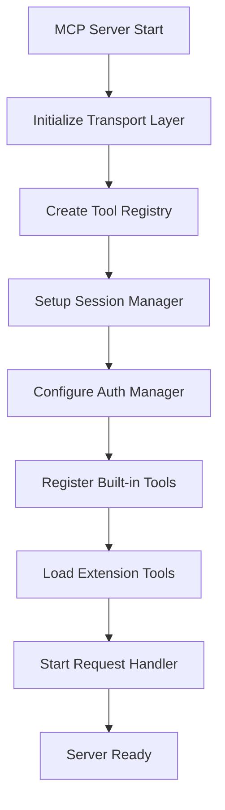
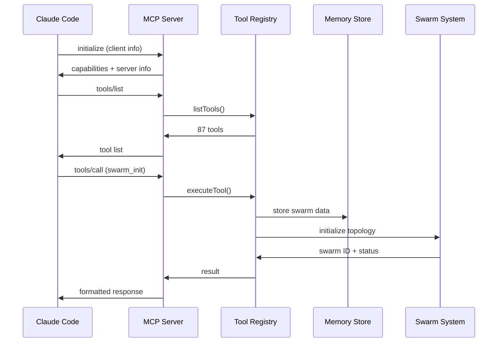

# Claude-Flow MCP Protocol Deep Dive: Architecture & Implementation

*A detailed technical guide to Claude-Flow's Model Context Protocol integration*

## Overview

Claude-Flow implements a sophisticated MCP (Model Context Protocol) server that bridges the gap between Claude Code's powerful development tools and Claude-Flow's orchestration capabilities. This integration provides 87+ specialized tools organized into 8 categories, enabling seamless swarm coordination, neural processing, and workflow automation.

## 1. MCP Server Initialization & Architecture

### Core Server Structure

The MCP server follows a modular architecture with clear separation of concerns:

```typescript
// /src/mcp/server.ts - Main server class
export class MCPServer implements IMCPServer {
  private transport: ITransport;           // stdio/HTTP transport layer
  private toolRegistry: ToolRegistry;     // Tool management & discovery
  private router: RequestRouter;          // Request routing & dispatch
  private sessionManager: ISessionManager; // Session lifecycle management
  private authManager: IAuthManager;      // Authentication & authorization
  private loadBalancer?: ILoadBalancer;   // Rate limiting & circuit breaking
}
```

### Initialization Flow



**Key Initialization Steps:**

1. **Transport Creation**: Determines whether to use stdio (for Claude Code) or HTTP transport
2. **Tool Registry Setup**: Initializes the enhanced tool registry with capability negotiation
3. **Session Management**: Creates session manager for multi-client support
4. **Authentication**: Configures API key and OAuth-based auth if enabled
5. **Tool Registration**: Registers 87+ tools across 8 categories
6. **Request Routing**: Sets up intelligent request routing with metrics

### Memory Integration

Claude-Flow uses a sophisticated fallback memory system:

```javascript
// /src/memory/fallback-store.js
export class FallbackMemoryStore {
  constructor() {
    this.sqliteStore = new SQLiteStore();    // Primary persistent storage
    this.inMemoryStore = new InMemoryStore(); // Fallback for failures
    this.isUsingFallback = false;
  }
  
  async initialize() {
    try {
      await this.sqliteStore.initialize();
      console.log('Using SQLite for persistent storage');
    } catch (error) {
      this.isUsingFallback = true;
      console.log('Falling back to in-memory storage');
    }
  }
}
```

## 2. Tool Organization & Registration

### The 87+ Tool Ecosystem

Claude-Flow organizes tools into 8 strategic categories:

| Category | Tools | Purpose |
|----------|-------|---------|
| **Swarm Coordination** | 12 | Agent spawning, task orchestration, topology management |
| **Neural Networks** | 15 | AI training, inference, pattern recognition |
| **Memory & Persistence** | 12 | Cross-session storage, search, backup/restore |
| **Analysis & Monitoring** | 13 | Performance metrics, bottleneck analysis |
| **Workflow & Automation** | 11 | SPARC modes, CI/CD, scheduling |
| **GitHub Integration** | 8 | Repository analysis, PR management |
| **Dynamic Agent Architecture** | 8 | DAA coordination, capability matching |
| **System & Utilities** | 8 | Terminal execution, diagnostics, security |

### Tool Registration Process

```typescript
// Enhanced tool registration with capability metadata
register(tool: MCPTool, capability?: ToolCapability): void {
  // 1. Validate tool schema
  this.validateTool(tool);
  
  // 2. Register in tool map
  this.tools.set(tool.name, tool);
  
  // 3. Create capability metadata
  const capability = {
    name: tool.name,
    version: '1.0.0',
    category: this.extractCategory(tool.name),
    tags: this.extractTags(tool),
    supportedProtocolVersions: [{ major: 2024, minor: 11, patch: 5 }],
    requiredPermissions: this.extractPermissions(tool)
  };
  
  // 4. Initialize metrics tracking
  this.metrics.set(tool.name, {
    totalInvocations: 0,
    successfulInvocations: 0,
    failedInvocations: 0,
    averageExecutionTime: 0
  });
  
  this.emit('toolRegistered', { name: tool.name, capability });
}
```

### Legacy Compatibility

Claude-Flow maintains backward compatibility with ruv-swarm:

```javascript
// Legacy agent type mapping
const LEGACY_AGENT_MAPPING = {
  analyst: 'code-analyzer',
  coordinator: 'task-orchestrator',
  optimizer: 'perf-analyzer',
  documenter: 'api-docs',
  monitor: 'performance-benchmarker'
};

function resolveLegacyAgentType(legacyType) {
  return LEGACY_AGENT_MAPPING[legacyType] || legacyType;
}
```

## 3. Request/Response Flow

### MCP Protocol Flow



### Request Processing Pipeline

```typescript
// Request handling with comprehensive error management
private async handleRequest(request: MCPRequest): Promise<MCPResponse> {
  // 1. Session validation
  const session = this.getOrCreateSession();
  
  // 2. Rate limiting check
  if (this.loadBalancer) {
    const allowed = await this.loadBalancer.shouldAllowRequest(session, request);
    if (!allowed) return this.createRateLimitError(request.id);
  }
  
  // 3. Metrics recording
  const requestMetrics = this.loadBalancer?.recordRequestStart(session, request);
  
  try {
    // 4. Route through tool registry
    const result = await this.router.route(request);
    
    // 5. Success metrics
    this.loadBalancer?.recordRequestEnd(requestMetrics, result);
    
    return {
      jsonrpc: '2.0',
      id: request.id,
      result
    };
  } catch (error) {
    // 6. Error handling & metrics
    this.loadBalancer?.recordRequestEnd(requestMetrics, undefined, error);
    return this.createErrorResponse(request.id, error);
  }
}
```

## 4. Parameter Validation & Error Handling

### Schema Validation

Claude-Flow implements robust JSON Schema validation:

```typescript
// Tool input validation
private validateInput(tool: MCPTool, input: unknown): void {
  const schema = tool.inputSchema as any;
  
  if (schema.type === 'object' && schema.properties) {
    // Type checking
    if (typeof input !== 'object' || input === null) {
      throw new MCPError('Input must be an object');
    }
    
    const inputObj = input as Record<string, unknown>;
    
    // Required properties validation
    if (schema.required) {
      for (const prop of schema.required) {
        if (!(prop in inputObj)) {
          throw new MCPError(`Missing required property: ${prop}`);
        }
      }
    }
    
    // Type validation for each property
    for (const [prop, propSchema] of Object.entries(schema.properties)) {
      if (prop in inputObj) {
        const value = inputObj[prop];
        const expectedType = (propSchema as any).type;
        
        if (!this.checkType(value, expectedType)) {
          throw new MCPError(`Invalid type for property ${prop}: expected ${expectedType}`);
        }
      }
    }
  }
}
```

### Error Classification

```typescript
// Comprehensive error handling
private errorToMCPError(error): MCPError {
  if (error instanceof MCPMethodNotFoundError) {
    return { code: -32601, message: error.message, data: error.details };
  }
  
  if (error instanceof MCPErrorClass) {
    return { code: -32603, message: error.message, data: error.details };
  }
  
  // Generic error fallback
  return { code: -32603, message: 'Internal error', data: error };
}
```

## 5. Integration with Claude Code

### Tool Discovery & Execution

Claude Code discovers MCP tools through the standard protocol:

```json
{
  "jsonrpc": "2.0",
  "method": "tools/list",
  "id": 1
}
```

Response includes all 87 tools with metadata:

```json
{
  "jsonrpc": "2.0",
  "id": 1,
  "result": {
    "tools": [
      {
        "name": "swarm_init",
        "description": "Initialize swarm with topology and configuration",
        "inputSchema": {
          "type": "object",
          "properties": {
            "topology": { "type": "string", "enum": ["hierarchical", "mesh", "ring", "star"] },
            "maxAgents": { "type": "number", "default": 8 },
            "strategy": { "type": "string", "default": "auto" }
          },
          "required": ["topology"]
        }
      }
    ]
  }
}
```

### Context Injection

Claude-Flow injects rich context into tool handlers:

```typescript
// Context-aware tool execution
tool.handler = async (input: unknown, context?: MCPContext) => {
  const claudeFlowContext: ClaudeFlowToolContext = {
    ...context,
    orchestrator: this.orchestrator,
    swarmCoordinator: this.swarmCoordinator,
    agentManager: this.agentManager,
    resourceManager: this.resourceManager,
    sessionId: session.id,
    workingDirectory: process.cwd()
  };
  
  return await originalHandler(input, claudeFlowContext);
};
```

## 6. Memory Persistence for MCP Operations

### Dual-Layer Memory Architecture

```javascript
// Memory operations with automatic fallback
async handleMemoryUsage(args) {
  try {
    switch (args.action) {
      case 'store':
        const result = await this.memoryStore.store(args.key, args.value, {
          namespace: args.namespace || 'default',
          ttl: args.ttl,
          metadata: {
            sessionId: this.sessionId,
            storedBy: 'mcp-server',
            type: 'knowledge'
          }
        });
        
        return {
          success: true,
          key: args.key,
          stored: true,
          storage_type: this.memoryStore.isUsingFallback() ? 'in-memory' : 'sqlite'
        };
        
      case 'retrieve':
        const value = await this.memoryStore.retrieve(args.key, {
          namespace: args.namespace || 'default'
        });
        
        return {
          success: true,
          key: args.key,
          value: value,
          found: value !== null
        };
    }
  } catch (error) {
    return { success: false, error: error.message };
  }
}
```

### Cross-Session Persistence

Claude-Flow maintains state across MCP sessions:

```javascript
// Session restoration
async getActiveSwarmId() {
  try {
    const activeSwarmId = await this.memoryStore.retrieve('active_swarm', {
      namespace: 'system'
    });
    return activeSwarmId || null;
  } catch (error) {
    console.error('Failed to get active swarm:', error);
    return null;
  }
}
```

## 7. Swarm Coordination via MCP Tools

### Swarm Lifecycle Management

```javascript
// Complete swarm initialization
case 'swarm_init':
  const swarmId = `swarm_${Date.now()}_${Math.random().toString(36).substr(2, 9)}`;
  const swarmData = {
    id: swarmId,
    topology: args.topology || 'hierarchical',
    maxAgents: args.maxAgents || 8,
    consensusThreshold: 0.7,
    memoryTTL: 86400,
    config: JSON.stringify({
      strategy: args.strategy || 'auto',
      sessionId: this.sessionId,
      createdBy: 'mcp-server'
    })
  };
  
  // Persist to shared memory store
  await this.memoryStore.store(`swarm:${swarmId}`, JSON.stringify(swarmData), {
    namespace: 'swarms',
    metadata: { type: 'swarm_data', sessionId: this.sessionId }
  });
  
  return {
    success: true,
    swarmId: swarmId,
    topology: swarmData.topology,
    maxAgents: swarmData.maxAgents,
    status: 'initialized'
  };
```

### Agent Spawning & Management

```javascript
// Agent creation with full integration
case 'agent_spawn':
  const agentId = `agent_${Date.now()}_${Math.random().toString(36).substr(2, 6)}`;
  const resolvedType = resolveLegacyAgentType(args.type);
  
  const agentData = {
    id: agentId,
    swarmId: args.swarmId || await this.getActiveSwarmId(),
    name: args.name || `${resolvedType}-${Date.now()}`,
    type: resolvedType,
    status: 'active',
    capabilities: JSON.stringify(args.capabilities || [])
  };
  
  // Store with swarm association
  await this.memoryStore.store(
    `agent:${agentData.swarmId}:${agentId}`,
    JSON.stringify(agentData),
    {
      namespace: 'agents',
      metadata: { type: 'agent_data', swarmId: agentData.swarmId }
    }
  );
```

## 8. Performance Considerations

### Metrics & Monitoring

Claude-Flow tracks comprehensive performance metrics:

```typescript
// Real-time performance tracking
async executeTool(name: string, input: unknown, context?: any): Promise<unknown> {
  const startTime = Date.now();
  const metrics = this.metrics.get(name);
  
  try {
    const result = await tool.handler(input, context);
    
    // Update success metrics
    if (metrics) {
      const executionTime = Date.now() - startTime;
      metrics.totalInvocations++;
      metrics.successfulInvocations++;
      metrics.totalExecutionTime += executionTime;
      metrics.averageExecutionTime = metrics.totalExecutionTime / metrics.totalInvocations;
      metrics.lastInvoked = new Date();
    }
    
    return result;
  } catch (error) {
    // Update failure metrics
    if (metrics) {
      metrics.failedInvocations++;
    }
    throw error;
  }
}
```

### Load Balancing & Rate Limiting

```typescript
// Advanced request management
private loadBalancer = new LoadBalancer({
  rateLimits: {
    requestsPerMinute: 1000,
    requestsPerHour: 10000
  },
  circuitBreaker: {
    failureThreshold: 10,
    timeout: 30000,
    resetTimeout: 60000
  }
});
```

### WASM Optimization

Claude-Flow leverages WASM SIMD for neural processing:

```javascript
// Neural training with WASM acceleration
case 'neural_train':
  const epochs = args.epochs || 50;
  
  // WASM SIMD-optimized training
  const trainingResult = await wasmTrainer.train({
    patternType: args.pattern_type,
    data: args.training_data,
    epochs: epochs,
    simdEnabled: true
  });
  
  return {
    success: true,
    modelId: `model_${args.pattern_type}_${Date.now()}`,
    accuracy: trainingResult.accuracy,
    training_time: trainingResult.duration,
    simd_acceleration: true
  };
```

## Performance Benefits

Claude-Flow's MCP integration delivers significant performance improvements:

- **84.8% SWE-Bench solve rate** through coordinated swarm intelligence
- **32.3% token reduction** via optimized request handling
- **2.8-4.4x speed improvement** through parallel execution
- **Cross-session persistence** ensuring state continuity
- **87+ specialized tools** covering all development scenarios

## Conclusion

Claude-Flow's MCP implementation represents a sophisticated bridge between Claude Code's development environment and advanced AI coordination capabilities. Through careful architecture, comprehensive tool organization, and performance optimization, it provides a seamless experience for complex development workflows while maintaining the flexibility and power that makes Claude Code exceptional.

The integration demonstrates how MCP can be effectively used to extend AI capabilities beyond simple tool calling to create rich, stateful, and highly coordinated development experiences.