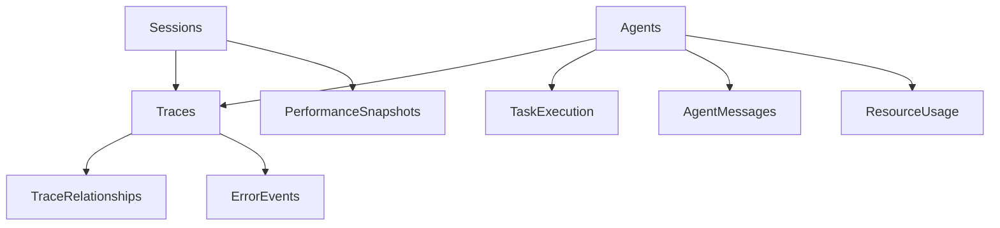

# SQLite Tracing Storage Implementation

## Overview

The `TraceStorage` class provides a high-performance SQLite backend for the Claude-Flow tracing system. It's designed to handle 1000+ traces per second with sub-50ms query times while maintaining storage under 100MB for 10K traces.

## Key Features

### ⚡ Performance Optimizations

- **Connection Pooling**: Multiple SQLite connections for concurrent operations
- **Batch Processing**: Automatic batching with configurable batch sizes (default: 1000)
- **WAL Mode**: Write-Ahead Logging for better concurrency
- **Prepared Statements**: Pre-compiled SQL statements for faster execution
- **Smart Indexing**: Comprehensive indexes for all common query patterns

### 🔄 Reliability Features

- **Retry Logic**: Exponential backoff for database busy conditions
- **Transaction Safety**: All batch operations wrapped in transactions  
- **Data Validation**: Input validation to prevent corrupt data
- **Graceful Degradation**: Continues operation even if some features fail

### 💾 Storage Efficiency

- **Data Compression**: Automatic gzip compression for large payloads (>1000 bytes)
- **Automatic Archiving**: Configurable cleanup of old traces
- **Index Optimization**: Optimized indexes to balance query speed vs storage
- **Vacuum Scheduling**: Automatic database maintenance

### 📊 Comprehensive Schema

Supports both the core tracing schema and extended monitoring:

```sql
-- Core Tables
traces              -- Main trace events
trace_relationships -- Parent-child relationships  
sessions           -- Tracing sessions
performance_snapshots -- System performance data

-- Extended Tables
trace_events       -- Alternative event format
agents             -- Agent metadata
error_events       -- Error tracking
agent_messages     -- Inter-agent communication
task_execution     -- Task lifecycle
resource_usage     -- Resource monitoring
```

## API Reference

### Core Operations

```typescript
// Store single trace
await storage.storeTrace(trace);

// Store batch (recommended for performance)
await storage.storeBatch(traces);

// Query by session
const traces = await storage.getTracesBySession(sessionId, {
  timeRange: { start: timestamp1, end: timestamp2 },
  agentIds: ['agent1', 'agent2'],
  limit: 100
});

// Build visualization graph
const graph = await storage.getTraceGraph(sessionId);
```

### Session Management

```typescript
// Create session
const sessionId = await storage.createSession('My Session', metadata);

// Update session
await storage.updateSession(sessionId, { 
  status: 'completed', 
  endTime: Date.now() 
});

// Get session info
const session = await storage.getSession(sessionId);
```

### Performance Monitoring

```typescript
// Store performance snapshot
await storage.storePerformanceSnapshot(sessionId, {
  cpu: 75.5,
  memory: 1024 * 1024 * 512,
  activeAgents: 5
});

// Store resource usage
await storage.storeResourceUsage(
  agentId, 
  cpuPercent, 
  memoryBytes,
  diskBytes,
  networkIn,
  networkOut,
  openFiles
);
```

### Error Tracking

```typescript
// Store error event
await storage.storeErrorEvent(
  traceId,
  'RuntimeError', 
  'Task failed to execute',
  stackTrace,
  'Restarted with fallback strategy'
);

// Get unresolved errors
const errors = await storage.getErrorEvents({ resolved: false });

// Mark error as resolved
await storage.resolveError(errorId, 'Applied hotfix v1.2.3');
```

### Advanced Querying

```typescript
// Query by time range
const traces = await storage.getTracesByTimeRange(timeRange, {
  sessionIds: ['session1', 'session2'],
  agentIds: ['agent1'],
  eventTypes: ['task_start', 'task_complete']
});

// Query by agent
const agentTraces = await storage.getTracesByAgent(agentId, {
  timeRange,
  limit: 50
});

// Get agent messages
const messages = await storage.getAgentMessages(agentId, timeRange);

// Get task history
const tasks = await storage.getTasksByAgent(agentId, 100);
```

## Configuration

```typescript
interface StorageConfig {
  databasePath: string;        // SQLite file path
  maxFileSize: number;         // Max DB size before archiving
  maxFiles: number;            // Retention period (in days)
  compressionLevel: number;    // Min bytes to trigger compression
  indexingEnabled: boolean;    // Enable performance indexes
  vacuumInterval: number;      // Maintenance interval (ms)
}

interface TracingConfig {
  enabled: boolean;
  samplingRate: number;        // 0.0 - 1.0
  bufferSize: number;          // Batch buffer size
  flushInterval: number;       // Auto-flush interval (ms)
  storageRetention: number;    // Retention period (ms)
  compressionEnabled: boolean;
  realtimeStreaming: boolean;
  performanceMonitoring: boolean;
  level?: string;              // 'debug' for verbose logging
}
```

## Performance Characteristics

### Write Performance
- **Target**: 1000+ traces/second
- **Batch Size**: 1000 traces (configurable)
- **Flush Interval**: 1 second (configurable)
- **Connection Pool**: 3 connections (configurable)

### Query Performance  
- **Target**: <50ms for typical queries
- **Indexes**: 25+ optimized indexes
- **Query Optimization**: Prepared statements, composite indexes
- **Connection Reuse**: Pooled connections reduce overhead

### Storage Efficiency
- **Compression**: Automatic for payloads >1KB
- **Archiving**: Configurable auto-cleanup
- **Target**: <100MB for 10K traces
- **Maintenance**: Automatic VACUUM and ANALYZE

## Database Schema Highlights

### Smart Indexing Strategy

```sql
-- Core performance indexes
idx_traces_session_timestamp     -- Session-based queries
idx_traces_agent_timestamp       -- Agent-based queries  
idx_traces_session_agent_time    -- Combined filters
idx_traces_type_timestamp        -- Event type queries
idx_traces_parent_child          -- Relationship traversal

-- Extended monitoring indexes
idx_performance_metrics_agent    -- Agent performance
idx_task_execution_agent         -- Task tracking
idx_error_events_resolved        -- Error management
idx_agent_messages_sender        -- Message flow
```

### Data Relationships



## Error Handling & Recovery

### Database Busy Handling
- Automatic retry with exponential backoff
- Maximum 3 retry attempts
- Graceful degradation for persistent issues

### Data Validation
- Schema validation before storage
- Size limits (1MB per trace)
- Required field validation
- Type safety checks

### Connection Management
- Connection pooling prevents resource exhaustion
- Automatic connection recovery
- Graceful shutdown handling

## Maintenance & Monitoring

### Automatic Maintenance
- **Vacuum**: Every hour if DB >100MB
- **Archive**: Daily cleanup of old traces
- **Stats Collection**: Continuous monitoring

### Health Monitoring
```typescript
const stats = storage.getComprehensiveStats();
console.log({
  storage: stats.storage,     // DB size, record counts
  performance: stats.performance, // Queue length, pool usage
  health: stats.health        // Uptime, error rates
});
```

### Manual Operations
```typescript
// Force optimization
await storage.optimize();

// Archive old data
const archived = await storage.archiveOldTraces(72, {
  backup: true,
  backupPath: '/backups'
});

// Get detailed statistics
const stats = storage.getStorageStats();
```

## Integration Example

```typescript
import { TraceStorage } from './tracing/storage/trace-storage.js';

// Initialize storage
const storage = new TraceStorage({
  databasePath: './traces.db',
  maxFileSize: 100 * 1024 * 1024,
  maxFiles: 7, // 7 days retention
  compressionLevel: 1000,
  indexingEnabled: true,
  vacuumInterval: 3600000
}, {
  enabled: true,
  samplingRate: 1.0,
  bufferSize: 1000,
  flushInterval: 1000,
  storageRetention: 7 * 24 * 60 * 60 * 1000,
  compressionEnabled: true,
  realtimeStreaming: false,
  performanceMonitoring: true
});

// Use in tracing system
const sessionId = await storage.createSession('Production Run');

await storage.storeTrace({
  id: generateId(),
  timestamp: Date.now(),
  sessionId,
  type: 'agent_spawn',
  data: { agentType: 'worker', capabilities: ['processing'] },
  metadata: { source: 'swarm-coordinator', severity: 'low', tags: [] }
});
```

## Testing

Comprehensive test suite covers:
- Basic CRUD operations
- Batch processing
- Query performance
- Error handling
- Data compression
- Graph generation
- Storage management

Run tests:
```bash
npm test -- --testPathPattern=trace-storage.test.ts
```

## Best Practices

1. **Use Batching**: Always prefer `storeBatch()` over multiple `storeTrace()` calls
2. **Index Usage**: Structure queries to utilize existing indexes
3. **Connection Limits**: Monitor connection pool usage
4. **Regular Maintenance**: Enable automatic maintenance tasks
5. **Monitoring**: Track storage statistics and performance metrics
6. **Error Recovery**: Implement proper error handling in calling code

## Future Enhancements

- [ ] Read replicas for query scaling  
- [ ] Partitioning for large datasets
- [ ] Streaming query results
- [ ] Custom compression algorithms
- [ ] Real-time analytics integration
- [ ] Multi-database sharding